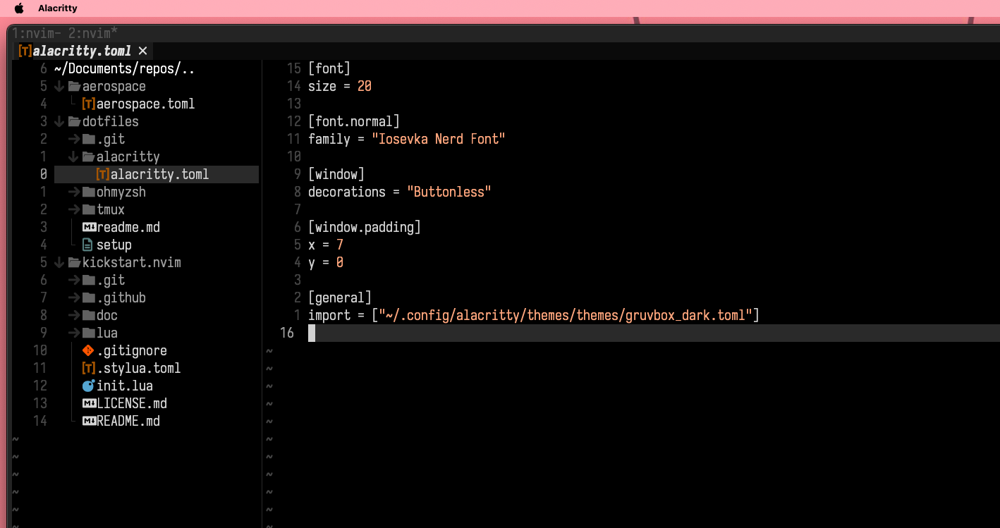

# Ieuyo's dotfiles
My configuration files for zsh, vim, tmux, alacritty and aerospace.

## Neovim setup

## Shell
I am using oh-my-zsh.

## OS
This configuration are thought to Unix like systems, and created on a M1.
