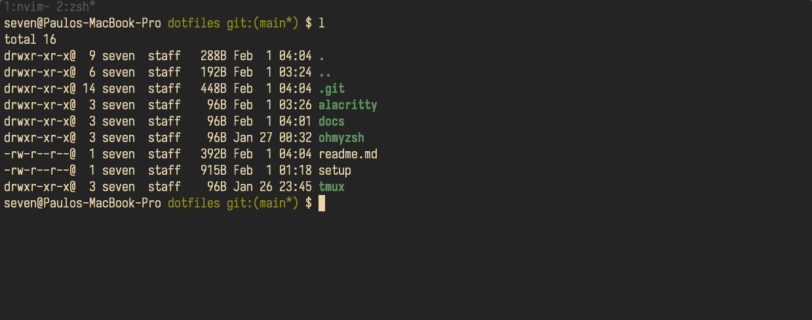

# Ieuyo's dotfiles
My configuration files for zsh, vim, tmux, alacritty and aerospace.

## Neovim setup

## Terminal setup (macOS & Linux)

## Font
Using Iosevka Nerd Font on nvim.
(https://github.com/be5invis/Iosevka)

## Theme
Yugen.
(https://github.com/bettervim/yugen.nvim)

## Shell
I am using oh-my-zsh.

## OS
This configuration are thought to Unix like systems, and created on a M1.
